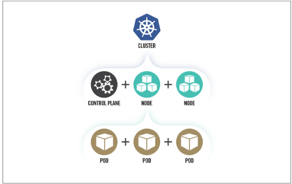

My notes from this ressources:
https://media.defense.gov/2021/Aug/03/2002820425/-1/-1/0/CTR_Kubernetes_Hardening_Guidance_1.1_20220315.PDF

*****

-> Supply chain risks are often challenging to mitigate and can arise in the container build cycle or infrastructure acquisition. 
-> Malicious threat actors can exploit vulnerabilities and misconfigurations in components of the Kubernetes architecture, such as the control plane, worker nodes, or containerized applications. 
-> Insider threats can be administrators, users, or cloud service providers. Insiders with special access to an organization’s Kubernetes  nfrastructure may be able to abuse these privileges.

*****

This guide details the following mitigations:
* Scan containers and Pods for vulnerabilities or misconfigurations.
* Run containers and Pods with the least privileges possible.
* Use network separation to control the amount of damage a compromise can
cause.
* Use firewalls to limit unneeded network connectivity and use encryption to protect confidentiality.
* Use strong authentication and authorization to limit user and administrator access as well as to limit the attack surface.
* Capture and monitor audit logs so that administrators can be alerted to potential malicious activity.
* Periodically review all Kubernetes settings and use vulnerability scans to ensure risks are appropriately accounted for and security patches are applied.
*****

*****

Kubernetes clusters can be complex to secure and are often abused in compromises that exploit their **misconfigurations**.

*****

Kubernetes can be a valuable target for data or compute power theft.

*****

Cyber actors seeking computational power (often for cryptocurrency mining) are also drawn to Kubernetes to harness the underlying infrastructure