**Comme j'ai lu le livre devant mon ordinateur et non sur mon téléphone, ce ne sont pas des highlights, mais des notes durant ma lecture.**

   

----------
# Chapitre 1.

Kube réponds aux scaling, cout et les délais des cycle de déploiement. L'explosion des microservice amene une complexité aux devOps. différents language et interpreteur. différents packages, différentes config. C'est la que docker règle bien des problèmes. Docker Swarm est renommé Docker Enterprise Edition. Comme Conteneur orchestration Kubernetes represente 77% du marché. Par rapport a OpenShift (9%), Swarm (5%), Mesos (4%).

Il y a deux types de nodes: Master et worker nodes. Le control plane (Kube-APIserver) roule sur le master nodes. Les worker sont des Kubelet.

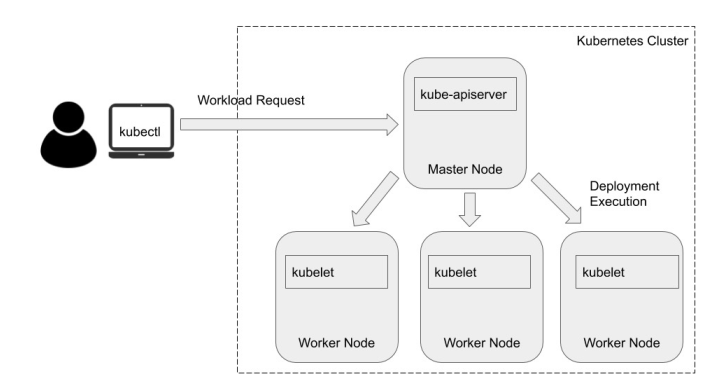

1. kube-apiserver: Controlplane. valide et vconfigure pour les objets. un object est comme un pod, un service ou un controle.
2. etcd: héberge les donnée comme les config, état et metadonnée. Il  surveille aussi pour les nouveaux updates et config a faire.
3. kube-scheduler: surveille pour creer des nouveaux pods et assiger les pods aux nodes. Crée une liste de nodes ou les pods peuvent rouler. Quels nodes ont quoi comme ressources et policies. Scheduler rank les nodes pour trouver le meilleurs node pour le pod.
4. Kube Controller

The YAML spec for a deployment consist of replicas.

Namespace is a virtual cluster.

Pods intéragis avec Kube-apiServer utilise un compte de service pour s'identifier. On a trois compte de service par défaut: kube-proxy, kube-dns, node-controller.

Network policies défini comment les pods peuvent communiquer entre eux. Par défaut c'est any any.

pod security policy c'est auniveau du cluster qui défini les conditions pour que le pod puisse rouler.

  
Minikube est parfait pour débuter avec kubernetes.

k3s est un lighware de kubernetes. Moins de 40mb, idéal for edge, IOT, ARM. Au lieu d'avoir etcd, utilise sqlite.

Par défault, kube is + ouvert et moins sécure que openshift.

Openshift est un produit offert par RedHat.

Kubedex (https://kubedex.com/google-gke-vs-microsoft-aks-vs-amazon-eks/) compare les  kubernetes services. GKE supporte Istio, sandbox, ingress managed ssl, mais AKS et EKS ne le supporte pas.

KOPS, kubernetes operation, aide a gérer kube. Controle quel os image on veut et setup mes ssh admin key pour les masters notes et workers nodes.

Bruce Schneier summed this up best in 1999 when he said **Complexity is the
worst enemy of security**
  

# Chapitre 2 - Kube networking
Chaque pod a sa propre ip address.

Pod dans un node communique sans NAT. Agent comme kubelet communique entre pod sur le même node.

Linux namespace est pour partitionner les ressources et l'isolations.

Namespace est fondamental pour les container. Pour linux 4,7, 7 types existes:
1. cgroup, IPC, network, Mount, PID, User et UTS

If we have multiple container in the same pod, communicate with IPC Object of POSIX message queue. Can share mounted volume (temporary memory, filesystem or cloud storage). We can aloso have a common PID namespace with shareProcessNamespace option in the podSpec. Avec ça, Application A et B, dans les conteneurs A et B peuvent communiquer ensemble avec SIGTERM et SIGKILL. Donc Processes are visible to other containers in the pod. This includes all information visible in /proc, such as passwords that were passed as arguments or environment variables. These are protected only by regular Unix permissions.

Le kubernetes service donne une une couche d'abstraction de comment acceder aux pods en utilisant des label au lieu d'IP. Kube-Proxy gère les flux de communication tout en communicant avec controlplane pour savoir si les services, ip ont changé.

un service peut avoir 4 différents types:

* ClusterIP (défault) seullement accessible dans le même cluster. On utilise kubectl proxy, mais préférable pour proxy.
* NodePort, static port on every node.
* Load balancer, A node balancer per service is usually an expensive options.
* External Name (CNAME)

CNI = Container Network interface. CNI is a Cloud Narive Computing Foundation (CNCF).

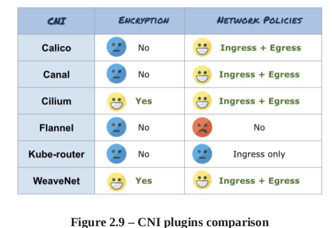

Calico is a open source projet that enables cloud native application connectiivty and policy (CNI plugin). Il peut s'intégrer avec Kubernetes, Apache Mesos, Docker, openStack.

Calico offre des meilleurs performances que les autres. Et offre une comprehension plus simple vs Kubernetes Built-in network policy. Kubernetes network policy peut seulement utilise le whitelist. Calico amenede des deny rules. 

a DeamonSet Service run in every node. Responsible for programming and routing kernel route

Il y a presque toujours un load balancer devant un cluster kubernetes. Un serice peut être exposé par un load balancer (Service A de la prochaine image). ou un NodePort (service B port 30000). Ingress n'est pas un service type c'est efficace et économique vs a loadBalancer.

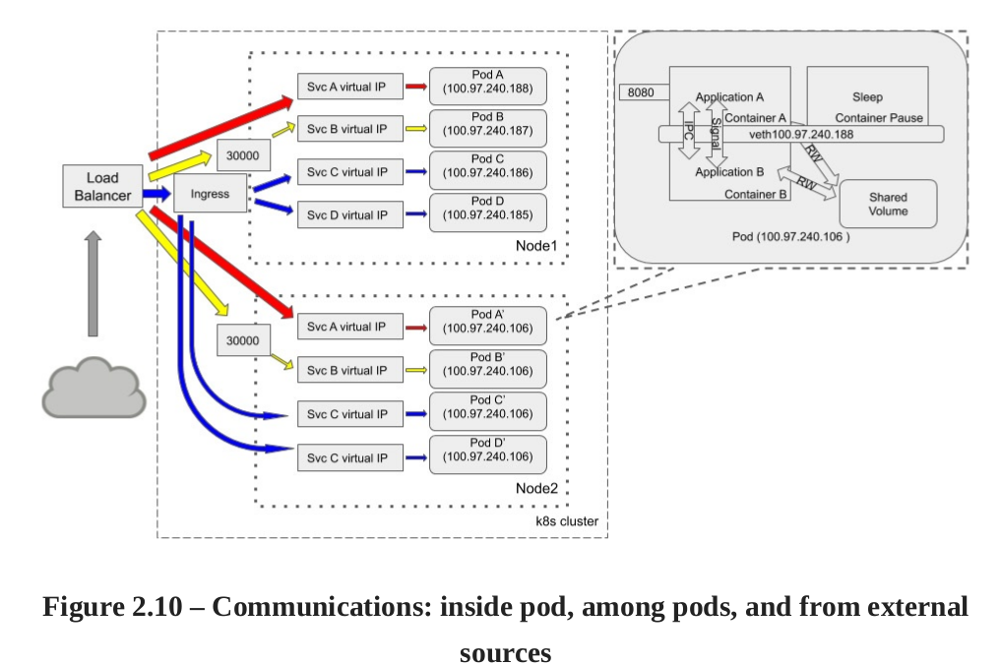

# Chapitre 3 - Threat modeling
Il faut identifier:

* intéractions.
* Acteurs de L'environnement
* Les composantes et objects
Après un bon threat model, il faut avoir défini : Actif, les contrôles, les acteurs, la surface d'attaque, les menaces, les mitigations.

Dans l'industrie nous avons différentes approche:

* STRIDE - What can go wrong?
* PASTA - Process Attack simulation and threat Analysis. attacker approach
* VAST - Visual Agile and simple threat Modeling - Should be more integrated with agile software development.

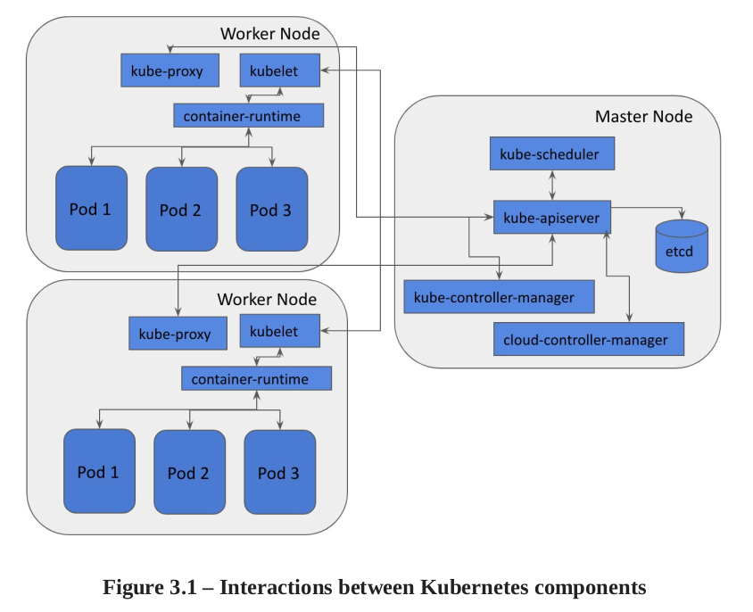

* Kube-APIserver- the control plane that validates and configures data for objects.
* etcd high-availability key-value store data like config, state and metadata.
* Kube-scheduler, watches for created pods and assigns the pods to nodes.
* Kube-controller-manager: State update and make changes to the cluster
* Cloud-controller-manager: interact with cloud privides
* Kubelet: Registrer de node with API server, ensure that the pods and containers are healthy.

Les threat actors sur Kubernetes peuvent être catégoriser par:

* End user. With the entry point (load balancer or ingress). Sometime pods or container is directly exposed on the internet.
* Internal Attacker: Malicious containers or pods spawned within the cluster
* Priviledged attacker: Admin, infra admin compromises kube-apiserver instances.

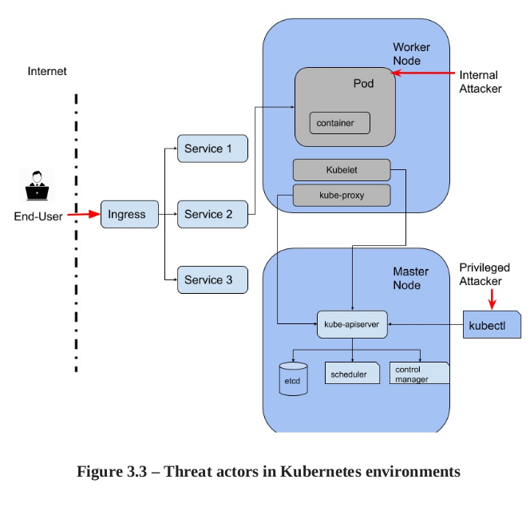

Il y a une bonne liste de threats qui vient avec la config par défaut de Kubernetes. Chapitre 3, page 126.

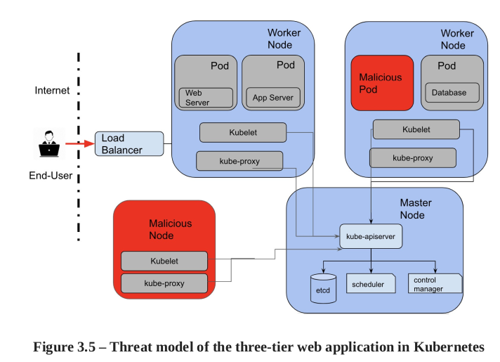
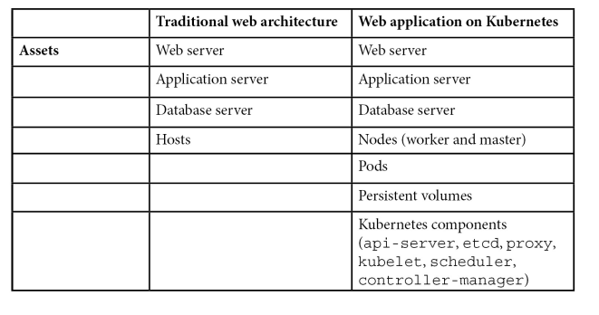
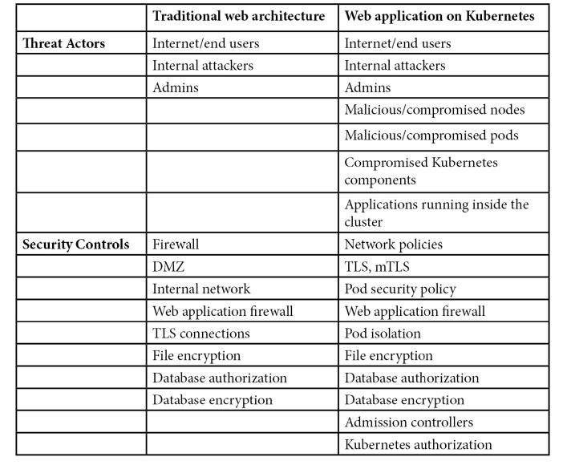

# Chapitre 4 - Least Privilege
Users in system:master group have the cluster-admin role.

RBAC element: 

* Subject. Three type: 
    * Regular users, created with LDAP, AD or private Key.
    * Service Acocunt: Pods authenticate to the Kube-APIServer. Restricted to the namespaces and credentials stored as secrets.
    * Anonymous user

* ressource
* verb

In kubernetes, there are no deny permission. Un rôle est restreint au namespace. Mais un clusterrole travaille au niveau du cluster.

Kubernetes namespace est un regroupement logique pour des ressources liés. Évite les collision de nom. Sur linux, isole les ressources systèmes. 

Kubernetes namespace permet a différentes applications, teams, user de travailler sur le même cluster. trois Namespace sont crée par défaut: Default (pour les ressources), kube-system (pour kube-apiserver, scheduler, manager) et kube-public (accessible a tous, mais rien n'est créer par défaut dans ce namespace.

Pour appliquer le least priv, on devrait se poser ces questions:

* Does the subject need privilege for a namespace or accress namespace?
* Privilege to a user, group or service acocunt? User in kube is for humain. Some microservice do not need priv at all as they dont interact with kube-apiserver.
* What ressources the subjects need to access. In role definition, need to set ressourcesNames or it will granted all the ressources of the ressource type.

Kube subjects interact with kube objects. We need to uderstand actual task for rbac properly.

## Least Priv for kube Workloads
Default service-account for kube workload should have least priv.

A pod may access ressources on the worker node, its control with the Security Context. Can be configure on the Pod level and Container level.

Security context for least priv for containers and pods:

* DAC, not running service as root (UID=0)
* SELinux, defines level label, role label, type label
* Privileged mode. Same as root user on node. Disable
* Linux Capabilities. manage action the container can do on the node. Exemple, CAP_AUDIT_WRITE allows process to write to the kernel.
* AppArmor profile. Define capabilites the process owns.
* Secure Computing Mode. White or blacklist the system can call.
* AllowPrivEsc: a process can gain more priv than its parent process.

PodSecurityPolicy, un kubernetes cluster-level qui controle the attributes of pod relevant to security. Example of following attribute:

* Allows priv container to run
* Allows host-level namespace
* Allows host ports to be used
* Require a read-only root filesystem
* requires a SELinux security context to be used
* Applies seccomp and appArmor profiles to pods
* etc. More on chapter 8.

We should set ressources limits for workloads.

**When pods or container run in priv mode, they have the same priv as admin user on the nodes. Should never be the case**

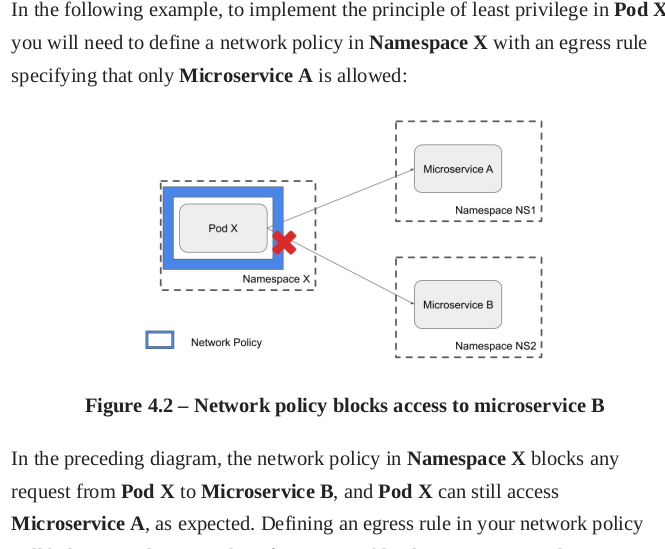

DevOps should consider using a PODSecurityPolicy and a network policy to enforce least privileges across cluster.
 
# Chapter 5 - Security Boundaries
Security boundaries: Data layer, network layer and system layer.

Compared to hypervisors, containers do not provide a strong security boudary. Container enforce restriction at application layer. Can be bypass from the kernel layer.

Network layer, network policie enforce that.

data layer, no writing in bin or root folder.  chroot prevent containers from tampering filesystem of other containers.

Database server exec in /bin is an example of execution crossing a trust boudary.

Data inserted by an end user into a trusted database is an example of data crossing a trust boudary.

We can have 3 security domain:

* Kubernetes master component (kube-apiserver, etcd, kube-controller, kube-scheduler).
* Kubernetes worker component
* Kubernetes objects, Pods, services, volumes and namespaces.

Lever of security Boundary:

* Container - Minimal isolation. Linux Namespace, AppArmor Profiles, seccomp profile
* Pod isolate more than container. Can also bring Security Context, networkPolicy, podSecurityPolicy.
* Nodes. We can use Nodesselector for specified pods to be run. Can use AppArmor and SELinux can help. Host-hardening mechanisms.
* Cluster is a collection of pods, containers and component of master node and worker nodes. Pods and containers running within a cluster are isolated from other cluster at the network and system layer. (A cluster is a group of servers or nodes.)
* Namespaces. Virtual cluster that isolate pods and services. Network Policies can be applied to the namespace lever. 
* Kube API-server. Kube API interact with all components. Its a proxy between cluster admin and cluster components.

By default, each pod have is own network Namespace and IPC namespace. by default, one container dont have knowledge of the other container. Never use host-level (hostNetwork, hostIPC, hostPID or shareProcessNamespace). If so, communication between container is easier and less control.

Default capabilities give an acceptable security level. Take with grain of salt the aditionnal capabilities to container.

**Network policies**

Pods inside a culster can communicate with each other.

The file NetworkPolicy have few key element:

* podselector: grouping of Pods which policy applies based on the pods labels.
* Ingress
    * IpBlock Ip CIDR range used to external IP block
    * NamespaceSelector: Namespace allowed. Among microservices in the same kubernetes cluster
    * podSelector. Among microservices in the same kubernetes cluster.
    * Ports
* egress
    * IPblock
    * namespaceSelector
    * podSelector
    * ports

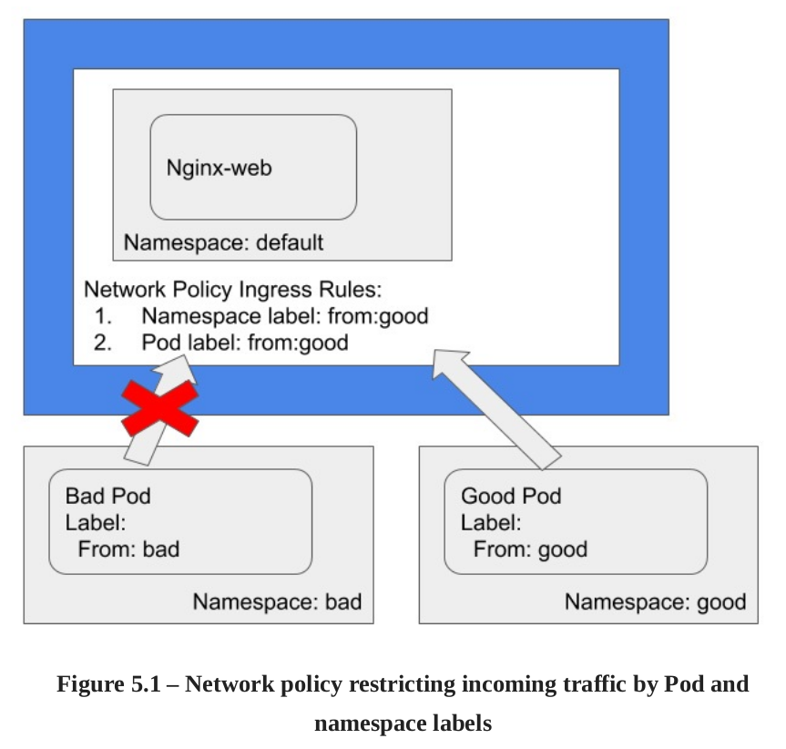

In the figure, even other pods in the good namespace cant communicate if he dosent have the label from: good

## Securing Cluster Components
Kube-Bench, walk through to evaluate security posture.

### Securing Kub-APIserver
Gateway to the cluster. API Rest to authorize and validate requests for objects. 3 main functions:

* Exposes API for cluster management. For dev and admin for chaging state of cluster.
* Request handling: Validate and processed request to object.
* Internal messaging: Interact with other components to ensure the cluster functions properly.

A request go throught 3 steps:
* Authentification. Client certifications, bearer tokens, basic Auth.
* Authorization: Abac (attribute-base), RBAC, node authorization and webhooks. Rbac is recommended.
* Admission controller. Check if the request is allow within the cluster.

You should:

* Disable anonymous auth.
* Disable Basic Auth.
* Disable token auth. (Static tokens). Client certif should be used.
* Kuberlet use HTTPS
* Disable Profiling. Its exposes unnecessary system and program details.
* Disable AlwaysAdmit. Use to admission control plugins.
* Use AlwaysPullImages: This prevents malicious pods from spinning up containers for images that exist on the node.
* Use SecurityContextDeny: only if PodSecurituyPolicy isnot ebabled.. Pods cants modify
* enable auditing.
* Disable AlwaysAllow authorization.
* Enable RBAC Auth.
* Valid certificate authority.
* Enable Service-account-lookup. Kube-apiserver verify that the token of the service account is present in etcd.
* Enable PodSecurityPolicy (and enable admission-plugins). Chapter 5 (security boundaries) use it. Detail in chapter 8 (Securings Pods).
* Use service acocunt key file. - Enables rotations of keys for services accounts. If not specified, kube-apiserver use private key from TLS so sign the service account tokens.
* Enable authorized requests to etcd: --etcd-certfile and --
* etcd-keyfile. unidentified request is rejected by etcd.
* Do not disable the ServiceAccount admission controller
* No selfSign for requests.
* Secure connection to etcd.
* Set --tls-cipher-suites to strong ciphers. --tls-min-version to 1.2 TLS.
* Enable advances auditing.

### Securing Kubelet
Kubelet manage life cycle, ensures objects are healthy.

To secure it:

* Disable Anonymous
* Set authorization mode.
* Rotate Kubelet certificates.
* Provide CA
* Disable read-only port..
* Enable the NodeRestriction admission controller. Allows kubelet only to modify node and pod.
* Restrict access to the Kubelet API with kube-apiserver only.

### Securing etcd
used for data storage: State, config and secrets. Only kube-apiserver shoud have access.

Should have:

* Retrict node access. Use Linux firewall.
* TLS and valid cert.
* Encrypt data at rest. -encryption-provider-config

### Securing Kube-scheduler
Kube-scheduler is responsible for assigning node to a pod. Then kubelet executes the pod.

Should have:

* disable profiling.
* Disable external connections
* Enable AppArmor. 

### Securing Kube-controller-manager
Kube-controller-manager. Monitors cluster to move the cluster from the current state to the derired state.

use- service-account-credentials with minimum priviledges.

### Securing CoreDNS
Kube-dns help objects (services, pods, containers) to locate each other. But have been replace with CoreDNS cause of vuln. Offer: DNS resolver, caching response and sidecar (monitors health and metrics for DNS).

Ensure health plugin is not disabled. (monitors status of CoreDNS).

**Enable istio for CoreDNS**. istio is a service mesh used for service discovery, load bal and auth. Its an external dependecy.

### Benchmarking a cluster's security configuration
kube-bench is a tool in Go published by aqua that runs tests documented in the CIS. 

`$kube-bench node --benchmark cis-1.4`

on Azure, AWS and GCp, kube-bech run as a pod.

`$ kubectl apply -f job-gke.yaml`

`$ kubectl get pods`

Every FAIL status should be mitigated.

Should be run regularly to monitor the cluster security.

CIS Benchmarks: https://www.cisecurity.org/benchmark/kubernetes/

# 7 - Authentification, authorization and Admission Control

Open Policy Agent (OPA) open source tool to implement authorization across microservices.

Kube-apiserver process all requests. 

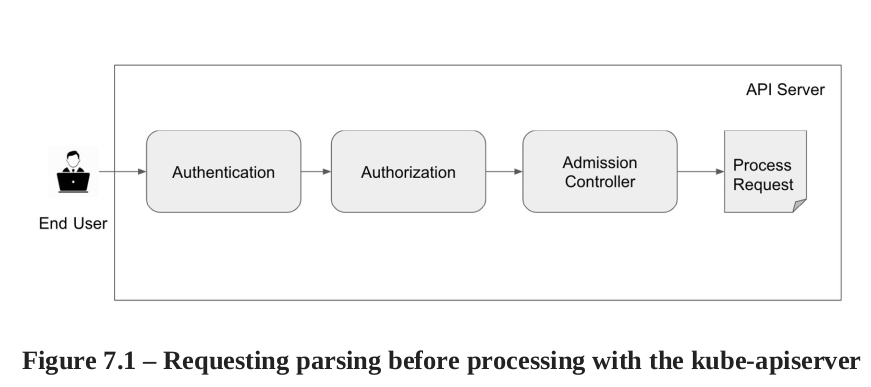

Admission controllers intercept requests that create, update or delete object. 2 categories:

* Mutating. Modify the request they admit.
* Validating

Kubernetes use many authentification:

* Client certiticates. The most common for production.
* Static tokens. Server uses a static file to read the bearer tokens. Not suitable for prod. Dev only. Cannot be change without restarting API server
* Basic Auth. Cannot be change without restarting API. not for Production.
* Bootstrap tokens. improvisation over static tokens. Its the default auth. Managed and stored as secrets in kube-system.
* Service Account tokens. Created by default at the pods creations. Associated secrets, the CA of the API server and signed token.
* WebHook token. Kube make a api call outside to determine user identity. -authorization-webhook-config-file=<path>.
* Authentication proxy. Can use x-remote request header.

User impersonation. admin and dev use it to debug auth and authorization policies for users. If user have impersonation priviledge. Example: `kubectl apply -f pod.yaml --as=dev-user --as-group=system:dev`

### Kubernetes authorization
There is different authorization modes:

1. Node authorization mode.Grant access to service, endpoints, nodes, pods, secrets and persistent volumes. The kubelet have a username system:node:<name> 
    1. API server uses —authorization-mode=Node flag to use the node authorization module.
    1. Use with ABAC or RBAC.
2. ABAC. Validating policies againts attributes of the request.
    2. Each policy have: Version, kind and spec.
3. RBAC. Set of permissions and RolBinding. Role and roleBinding are restricted to namespaces. If role span across namespaces, ClusterRole and ClusterRoleBinding can be use.
4. WebHooks. Similar for authentificaiton, webhook authorization uses remote API server to check permission.

### Admission controllers
The controller validate and mutate the request before modifying the state.

Security list:

* AlwaysPullImages. New pods always force image pull. Ensure updated images are used by pods. 
* EventRateLimit. Mitigate misbehaving object like high consumption, CPU network.
* LimitRanger. Ensure not violate limit of limitRange object. malicious pods cannot consume excess ressources.
* NodeRestriction. Kubelet gets a username and is only Able to modify the node object and pods on its own node.
* PersistenVolumeClaimResize.
* PodSecurityPolicy.  Determine where the pods run based on security-sensitive configuration of the pods. Can check fields like: Privileged, allowHostPaths, defaultAddCapabilities. See next chapter.
* SecurityContextDeny. Recommended if PodSecurityPolicy is not enabled.
* ServiceAccount is an identity of the pod.

### Introduction to OPA
Open source policy engine for policy enforcement in kubernetes. Istio utilize OPA for finer-grained controls. Hosted by CNCF. In kube, often used as a validating webhook.

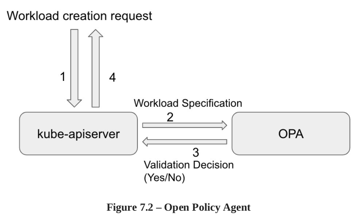

To make a decision OPA need: Cluster info, Input Query, policies (defined in a Rego language) To apply policy:

`kubectl create configmap pod —from-file=pod-blacklist.rego`

# Chapter 8. Securing Kubernetes pods

Buld stage: Harden image and security attributes of pods (pod templates). Somme security attributes like appArmor, SElinux labels take effect in runtime.

Secure pods in runtime stage: PodSecurityolicy and kube-psp-advisor.

Image scanning tool  focus on finding publicly disclosed. But Best practices with secure config ensure minimal attack surface.

Dockerfile contains series of instructions such as copy files, configure variables, configure open port...

## CIS Docker benchmarks
CIS security recom for container images:

* Create a user for a container image to run microservice. A non-root user.
* Build image from trusted. Public repo may contain malware or crypto miners.Image from scratch as much as possible. Scan image after the build.
* Keep image with the less packages as possible. Remove tools after the building process if possible.
* Scan and rebuild image for security patches.
* Use Content trust for Docker. Use signatures to ensure data integrity between client and docker registry. 
* HEALTHCHECK instruction to the container image. base on Health status check, may initiates a new one.
* Don't use RUN apt-get update in a single line. Cause it will use old package repo that is cached. Use —no-cache flag in the docker build.
* Remove setUID and setGID permission from files in images. Can be used for priv-esc. Review file with setuid and setgid.
* Use COPY instead of ADD in dockerfile.
* Do not store secret in dockerfile. Tool exist to extract image file layers. A common mistka is to use ENV instruction.
* Install verified package only. Trusted package repositories.

## Configuring the security attributes of pods
What privileges a microservice must have to perform tasks. Should harden at pod and container level. 4 major categories:

1. Setting host namespaces for pods
2. Security context at the container level
3. Security context at the pod level
4. AppArmor profile.

## Setting host-level namespace for pods
Attributes in the pod

* hostPID: Allows pod to have visibility on all processes on the node.
* hostNetwork: Have visibility on all netork stack on the node.
* hostIPC: Have visibility on all IPC ressource on the node.

Those attributes should be at FALSE.

## Security Context for container
We can have 3 containers in one pod. And one of them has to run in priv mode. Here the principal atributes of a security context for containers:

* Privileged. to true makes process runing as root user.
* Capabilities. CAP_SETPCAP, CAP_MKNOD, CAP_AUDIT_WRITE ...  
    * CAP_SYS_ADMIN and CAP_NETWORK_ADMIN should be added with caution
* allowPrivilegeEscalation. Process can gain more privileges than its parent process.
* readOnlyRootFileSystem. Good practice to set it to true. For library, config files...
* runAsNonRoot.  Should be set to true. Kubelet will prevent the container starting as a root.
* runAsUser.

## APPArmor profiles
AppArmor profile defines what the process owns, network ressources and files that can be accessd by the container.

Its operated through kubectl (its not a pod).

Writing a robust APpArmor profile is not easy. But basic restrictions like deny directoriers, read-only, etc.

Bane is a open-source tool can help create appArmor profiles. But AppArmor is still in alpha node.

## The power of PodSecurityPolicy
Policy to evaluate the security attributes defined in the  pods specification. Can be used to block launch of priv pods, limited pod access to the host filesystem. For example, can be control by PodSecurityPolicy: Privileged, hostPID, hostNetwork, hostIPC, allowedCapabilies, defaultAddCapabilites, seLinux. 

To apply PodSecurityPolicy:

`$ kubectl apply -f example-psp.yaml`

And to verify that PodSecurityPolicy (PSP) has been created:

`$ kubectl get psp`

## Kubernetes PodSecurityPolicy Advisor
Kube-PSP-advisor is a open source tool from Sysdig. its a kubectl plugin. $ kubectl krew install advise-psp

scans security attributes and recommends pod securit policies.

Then, the tool generate multiple recommendation like: HstIPC: true, hostPID, seLinux, allowedCapabilies

## Summary
We look at podSecurityPolicy and kube-psp-advisor which facilitates pod security policies. 
Security controls need to be applied from build, deploymen and runtime

# Chapter 9 - Image scanning in pipelines
Anchore Engine, popular open source image scanning tool. 
Vulnerabilities may come from application libraries or tools inside image.

Sometimes, dev not follow security best practices to write code or download librairies fom untrust sources. And the base image we use.

`$ docker history kayzheh/anchore-cli ` we can see the file layer. When we install new packages or add file to the base, image size increases.

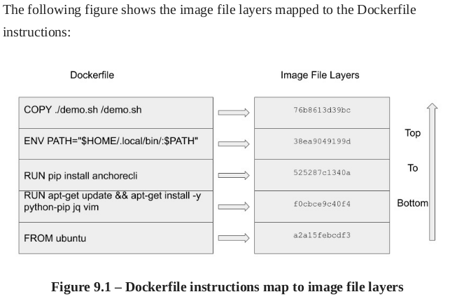

There is few popular open source image scanning tools available: Anchore, Clair, Trivvy.

## Scanning images with Anchore Engine
Not only analyse Docker Images, but also allows user define acceptances policy.
Anchore Engine will Analyse:

* Image Metadata, Images Layers, OS package such as dep rpm apkg, File Data, Application dependency pakages (ruby, node java, python), file content.

Deploy Anchore Engine with Helm (package manage tool for kube cluster)

`$ helm install anchore-demo stable/anchore-engine`

Anchore Engine give multiple microservices: 

* API - Accepts image scan request
* Catalog - States of image scan job
* Policy - Loads analysis and performs policy eval.
* Analyzer - Pull images from image registry and perform analysis
* Simplequeue - queues image scanning task
* PostgrSQL - Stores images results and state 

## Scanning images with anchore-cli
access from API and anchore-cli.

## Integrating image scaning in CI-CD
Passing an image scanin the build stage doesnt mean it will pass at the runtime stage. Image scanning should hapen in the build, deployment and the runtime of the image.

## Scaning at the build stage.
There is many CI-CD tool such Junkins, Spinnaker, ScrewDriver. Here, it will be image scanning into a GitHub workflow. Workflow in GitHub is a automated process with multiple jobs. Step of the workflow

* Check out PR Branch
* Build image from branch
* Push image to registry. 
* Scan the newly built or pushed image
* Fail the workflow if policy violations
