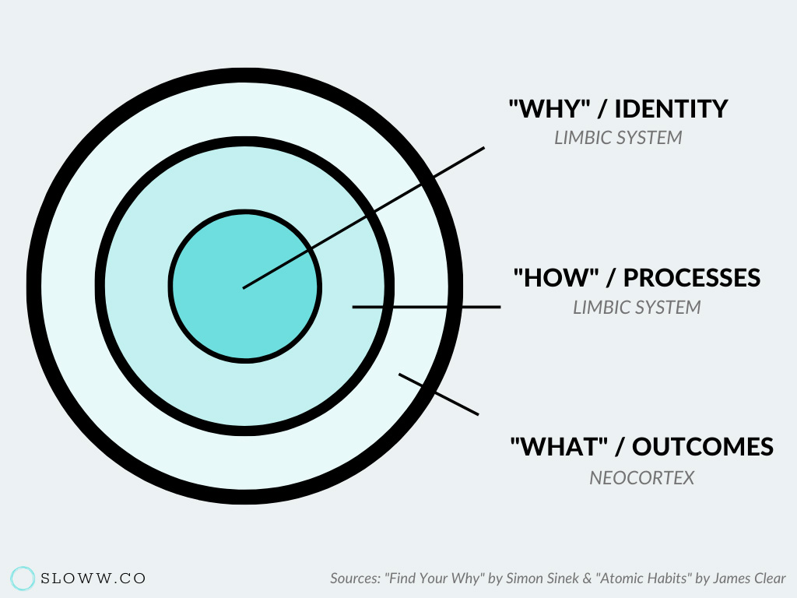

Le livre [Atomic habits](/atomic-habits-tiny-changes-remarkable-results/) est l'un des livres qui m'a le plus transformé.

Le livre commence par expliquer que les petites différences sont importante sur le long terme. Personne ne remarque si tu t'améliores d'un pourcent, mais les petits changements qui sont répété devienne significative sur plusieurs années. Par exemple:

* Si tu mets un peu d'argent de côté chaque semaine, tu ne deviens pas immédiatement financièrement indépendant. 
* Tu n'es pas en forme après deux scéances de gym. 
* Tu ne deviens pas obèse après avoir mangé un beigne. 

Mais l'accumulation des petites, bonnes ou mauvaises, habitudes s'accumulent et donne un résultat complètement différent avec le temps.

<blockquote class="blockquote text-right">
  
"Succes is a daily habits - not once -in -a -lifetime transformation."

  <footer class="blockquote-footer">Atomic Habits</footer>
</blockquote>

<blockquote class="blockquote text-right">
  
"If you want to predict where you'll end up in life, all you have to do is follow the curve of tiny gains or tiny losses, and see how your daily choices will compound ten or twenty years down the line."

  <footer class="blockquote-footer">Bill Gate</footer>
</blockquote>

Lorsqu'on introduis une nouvelle habitude, on s'imagine une progression linéaire, mais l'effort est habituellement visible beaucoup plus tard qu'on se l'imagine. Le livre appelle ce principe "Plateau du potentiel latent":

<blockquote class="blockquote text-right">
  
"Mastery require patience."

  <footer class="blockquote-footer">Atomic Habits</footer>
</blockquote>

Mais comment garder une habitude suffisamment longtemps pour voir les résultats? Il nous suggère d'arrêter de se concentrer sur le but, mais plutôt se concentrer sur le système. Le système est le processus que nous devons mettre en place qui nous permettra d'attendre un but. Se concentrer sur le système amène la solution au problème et lorsque tu tombes en amour avec ton système, tu n'as pas besoin d'atteindre le but pour être heureux.

<blockquote class="blockquote text-right">
  
"The purpose of setting goals is to win the game. The purpose of building a systems is to continue playing the game. True long-term thinking is goal-less thinking."

  <footer class="blockquote-footer">Atomic Habits</footer>
</blockquote>

Et la meilleure méthode d'avoir des nouveaux résultats est de changer ton identité. Par exemple:

* Au lieu de se donner l'objectif de lire un livre, devenez un lecteur.
* Au lieu de courir un marathon, devenez un courreur.

Suite à la lecture de ce passage, j'ai arreté les objectifs précis comme lire un livre (Objectif). J'ai arrêté les objectifs comme "lire 30 minutes par jour" (processus). Je m'identifie comme une personne qui lit régulièrement et qui aime ça. Je ne me culpabilise plus lorsque je ne lit pas certains soir (mentalité axé sur le processus). N'y de culpabilité si finalement, je n'aime pas le livre et j'arrête de le lire (mentalité axé sur le but). Depuis, je n'ai jamais lu autant de livre.

 

À l'inverse, une des meilleures façons de nuire à ta réussite est de former une identité négative, "je suis mauvais en français", "je suis mauvais avec les ordinateurs"... Y croire est effectivement la meilleure façon de le rester.

hugo<blockquote class="blockquote text-right">
  
"You might start a habit because of motivation, but the only reason you'll stick with one is that it becomes part of your identity."

  <footer class="blockquote-footer">Atomic Habits</footer>
</blockquote>

Chaque action que tu fais jour après jour influencera grandement ce que tu deviens plus tard. Est-ce que tu lis chaque jour? Est-ce que tu travailles sur un projet qui te passionne ? Est-ce que tu vas au gym ? Est-ce que tu passes trop de temps sur les médias sociaux ? Ces petites batailles que tu fais chaque jour influenceront énormément le cours de ta vie. Ne pensez pas arriver à une destination sans prendre action concrète vers cette direction aujourd'hui.

Un problème avec les objectifs de vie c'est qu'ils sont binaires. Soit tu as réussi, soit tu échoues. ça crée donc un effet va-et-viens sur ton humeur. C'est pourquoi les habitudes ne doivent pas être adressées avec des buts, mais plutôt avec un changement d'identité.

Mais alors... Comment on change une identité? C'est simple, en répétant un comportement, tu renforces l'identité associée à ce comportement. N'est-ce pas là paradoxal? Tes habitudes définit ton identité et ton identité définit tes habitudes, c'est une boucle continue de rétroaction.

Une habitude est un comportement qui a été répété si souvent qu'il devient automatique. 

<blockquote class="blockquote text-right">
  
"Building habits in the present allows you to do more of what you want in the future"

  <footer class="blockquote-footer">Atomic Habits</footer>
</blockquote>

Je terminerai en mentionnant que je n'ai résumé que la première partie du livre, environ le quart. Le reste explique en détail comment intégrer des habitudes. Il définit qu'une habitude peut se diviser en 4 étapes: 

1. Le signal: Rendez-le évident

2. L'envie: Rendez-le attrayant. 

3. La réponse: Rendez-le facile. 

4. La récompense: Rendez-le satisfaisant.

Il prend l'exemple aussi simple que : je rentre dans une chambre et il fait noir (c'est évident). Je veux voir (l'envie). J'allume la lumière (réponse). Maintenant je vois (récompense). 

Qui dois  "réfléchir" avant d'ouvrir la lumière? Une habitude répond à ce critère, on le fait, sans même y penser. 

La suite est à venir.