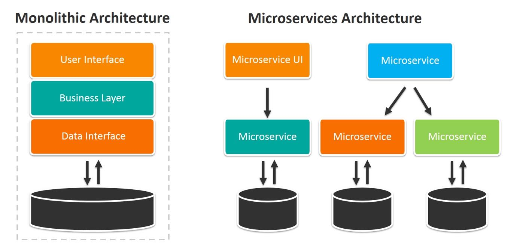
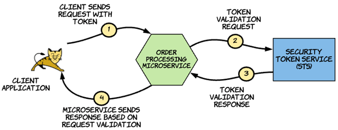
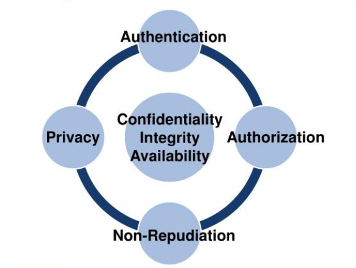
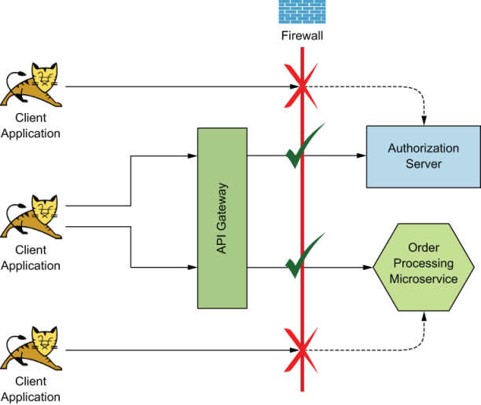

# Introduction
Avant de vous lancer dans la lecture, assurez-vous de bien comprendre certains principes de sécurité pour suivre. Ce n’est pas un article accessible aux nouveaux en sécurité. Par exemple, vous devez connaitre: la différence entre le mTLS et TLS, un JWT, clé privé/public, header d’un packet. Le livre est une combinaison de théorie et de pratique. Je n’expliquerai pas les étapes de développement et de déploiement d’un API avec un framework comme l’explique le livre.

Le livre commence avec une petite introduction aux vieilles applications legacy dites "monolithique". La majorité des applications monolithiques ont seulement quelques points d'entrées. La plupart des composantes d'une application monolithique ne sont pas exposées aux autres services. Par conséquent, la sécurité est renforcée de façon centrale à l'application et chaque composante n'ont pas besoin de faire des vérifications de sécurité avant d'exécuter la requête. Les communications se font avec les composante interne de l'application, dans le même processus. Mais l'arrivé des microservices explose le nombre d'entrées. Par conséquent, on augmente la surface d'attaque qui amène des défis de sécurisation.

<blockquote class="blockquote text-right">
  
"The security of a system is no stronger than the strength of its weakest link"

  <footer class="blockquote-footer">API security. Section 1.2.1</footer>
</blockquote>

<small>Source: [BMC](https://www.bmc.com/blogs/microservices-architecture/)</small>

Mais appliquer la sécurité à chaque microservice devient rapidement lourd pour les développeurs et amène une charge au réseau si le microservice doit, pour chaque requête, faire valider le jeton au gestionnaire d'identité fédéré (STS). On parle ici d'un service comme Auth0, Okta ou Azure AD.

<small>Source: Livre Microservice in Action</small>

Dans une application monolitique, les composantes internes partage la même session utilisateur, malheureusement, nous n'avons pas ce luxe avec les microservices. Déjà que nous explosons le nombre de porte d'entrée, il faut aussi propager entre les microservices le context de l'utilisateur (user context).
Le livre introduit ensuite des concepts fondamentaux à la sécurité que je vais simplement survoler ici:
1. Authentification. On parle ici d'un requérant qui peut-être:
    * Une application qui demande l’accès de la part de l’utilisateur (webApp, mobile app). 
    * Un système qui accède directement à un microservice. 
    * Un système qui agis au nom d'un autre système. 
    * Vous verrez plus tard qu'oAuth 2.0 est maintenant la solution standard, et vous verrez pourquoi.
2. Intégrité
    * La méthode la plus commune est de signer le message, ce que le TLS ("HTTPS") fait. 
3. Non-répudiation
    * Généralement assuré par la signature du message avec la clé privé du propriétaire. 
4. Confidentialité
    * Encore le TLS ;) 
    * Il amène un rappelle important concernant les proxy qui supportent deux modes: TLS Bridging et TLS tunneling. Les bridging termine les connections TLS et en débute une autre. La donnée passe donc en clair sur le proxy, vous ne devez donc pas lui faire confiance si vous ne le contrôlez pas. 
5. Disponibilité
    * Le système doit rester disponible, peut importe ce qui arrive! Enfin, presque. Contrairement à un monolithic, le système ne tombe pas si un bug touche un seul des microservices. 

La base de la sécurité au finale:

<small>Source: [IS3220](https://www.slideserve.com/kovit/is3220-information-technology-infrastructure-security-unit-2-network-security-basics)</small>

Je vais discuter de 4 sujets pris du livre directement:
1. Jeton Opaque, refresh, JWT...
2. La délégation
3. La sécurité à la frontière.
    * On parle ici du chemin entre l'utilisateur et l'API Gateway. Ou encore la sécurité Nord-Sud.
4. La sécurité entre les API 
    * Qu'on appelle la sécurité "Est-Ouest". Service Mesh. 

Généralement, l’API gateway concerne la sécurité Nord/Sud (Edge security) et le service mesh gère la sécurité Est/Ouest (sécurité entre les microservices).

# Jeton Opaque, refresh, JWT...
Lorsque l'API Gateway valide le jeton au STS, ça sappelle un *token introspection*. Mais si chaque requête fait par le client génère une requête au STS, la performance du STS se retrouve affecter. 

On se retrouve alors avec :
- L'utilisateur clique et génère une requête -> Le Gateway recois la requête et transfert le jeton au STS -> Le STS valide le jeton et réponds au gateway.

Jusque là, ça va. Imaginons un scénario d'entreprise où:

- Des milliers d'utilisateurs génèrent chacun d'eux des dizaines de requêtes à la minute. La dépendance entre le gateway et le STS devient crucial.

C’est pourquoi un jeton dit "opaque" (reference Token) n’est pas une bonne solution pour authentifier chaque action utilisateur.  Nous avons besoin d’une solution où l’API gateway est capable de valider lui même le jeton sans dépendre du STS. C’est ici que le JWT rentre en jeux. Les jetons JWT permetent à L’API Gateway de vérifier par lui même le jeton à l’aide de la clé public du STS. Il est alors fréquent d'avoir le jeton d'accès en format JWT.

**Alors tout est réglé...? Non.** 

Si l'individu recois un JWT après authentification,  nous rencontrons **un autre problème**: Il n'est alors plus possible de révoquer la session utilisateur, étant donnée que l’API Gateway ne dépends plus du STS pour le valider. C’est pourquoi les JWT ont des courtes durées de vie (quelques minutes jusqu’à quelques heures) puisque nous ne pouvons pas les révoquer en cas de compromission! Ils deviennent invalides à leurs date d'expiration naturelle inscrit par le STS. 

**Alors tout est réglé...? Pas encore!**

Aucun utilisateur souhaite se réauthentifier après chaque expiration du JWT! 

La solution est donc d'envoyer _deux_ jetons après l'authentification: un access token en format JWT qui est de courte durée et un jeton opaque de plus longue durée (qui est le refresh token). Cette solution nous permet d’ateindre nos trois objectifs:
1. L’API Gateway est beaucoup moins dépendant du STS.
2. Nous pouvons révoquer la session utilisateur en révoquant le refresh Token (qui est un jeton opaque). 
3. L’utilisateur rentre son mot de passe quand le refresh token est expiré (ou révoqué) seulement. 

Bien que l'access token est souvent en forme JWT, ils peuvent être opaque aussi. C'est souvent le cas lorsque le Gateway agit comme STS. 

# La délégation
Un sujet important qu'amène la sécurité aujourd'hui est le principe de délégation des accès. Vous avez surement déjà vu les fameux "Connectez-vous avec Google ou Facebook". avec les consentements . C'est le protocole OAUTH 2.0 en arrière. L’utilisateur délègue ses accès à l’application. L’application récupère un access token à l’authorization Server et fait ensuite une action au microservice.
Chapitre 3: Securing North/south traffic with an API Gateway “In an ideal world, the microservice developer should worry only about the business functionnality of a microservice, and the rest should be handled by specialized components with less hassle. The API Gateway and service Mesh are two architectural patterns that help us reach that ideal.” Page 58.
Un aspect clé des bonnes pratiques des microservices est le principe de responsabilité unique. Chaque microservice devrait exécuter une seule fonction. Sans paterns d’architecture, un microservice se trouve responsable : D’extraire le jeton de l’entête, communiquer avec le STS pour valider le jeton, gérer la réponse du STS et si c’est positif, exécuter la tâche business que le microservice est sensé faire. La combinaison de la sécurité et la tâche business introduis une complexité et une couche de gestion supplémentaire au microservice. Sans oublier que l’augmentation du nombre de microservices augmente aussi le nombre de requêtes au STS. L’utilisation d’un API Gateway permet d’avoir un meilleur découplage de la sécurité et le microservice.

# 1. Sécurité à la frontière
Les API ([Application Programming Interface](https://en.wikipedia.org/wiki/API)) sont ce que les entreprises décident d’exposer sur internet. Les microservices qui ont besoin d’être accèder par l’externe sont exposés comme un API via un API Gateway. En règle général, un API ne devrait **jamais** être directement accessible. Les flux doivent être intérompu par le gateway. L’API Gateway renforce plusieurs éléments de sécurité incluant l’athentification, les authorizations, “throttling” (limite le nombre de requête pour un jeton) et réalise des validations du contenu.

## 1.1 Pourquoi ne pas utiliser du Basic Authentification ? (3.2.3)
Le basic auth est simplement une combinaison d’un nom d’utilisateur et d’un mot de passe envoyé à l’API dans le header de la requête. Cette solution ne permet pas de déléguer des accès à une application tierce. Reprenons l’exemple de sitecomique123.com, si vous voulez vous authentifier avec Facebook, vous leurs donnerez alors votre username et password de Facebook. L’application pourait allors faire ce qu’il veut avec votre compte! De plus, le basic auth utilise un mot de passe static avec une durée de vie indéterminer. Alors l’application sitecomique123.com gardera indéfiniement votre mot de passe. Et une règle général en sécurité: Le plus longtemps l’information est sauvegardé à un endroit, plus les chances de compromission sont élevé.
Nous pouvons aussi avoir des enjeux de sécurité d'avoir un username/password dans le header: 

## 1.2 Et pourquoi ne pas utiliser mTLS?
Mutual Transport Layer Security est un mécanisme où l’application cliente vérifie le serveur et le serveur vérifie l’aplication cliente en échangeant leurs certificats. Le mtls résoud deux problèmes par rapport au basic auth: Une durée de vie limité dans le temps qui force leurs rotation et, surtout, le mTLS permet que la clé privé associé au certificat ne quite jamais le propriétaire. Mais comme le basic Auth, mtls ne permet pas non plus la délégation d’accès. Le mtls est principalement utilisé pour sécuriser la communication entre systèmes seulement et non pour des utilisateurs.

## 1.3 Et pourquoi Oath 2.0?

  

# Sécurité entre API
L'API Gateway interompt les requêtes aux API. Si tout semblent beau, il redirige la requête vers le bon API. Nous avons maintenant besoin de deux choses: sécuriser la communication entre le gateway et l’API et transférer le context utilisateur (user context) de la requête. La requête entre le gateway et l’API peut facilement se faire avec du mTLS, le context utilisateur peut être ajouter à l'entête de la requête, ou créer un jeton JWT. Le problème avec l'entête du packer c’est si l’API a besoin d'appeler un autre API (qui est fréquent), nous n’avons plus de garanti qu’il n’a pas été altéré par les API intermédiaire. Le JWT signé par le gateway donne alors une garanti que le userContext provient du gateway.
L’authentification service à service
Il y a trois méthodes possible pour gérer l’authentification service à service:
1. Avoir confiance au réseau (Trust the netwok) 
    1. Cette méthode n’est plus considéré comme une bonne pratique en entreprise. C’est avoir une confiance élevé en notre réseau et qu’aucun attaquant va réussir à entrer. C’est directement oposé au principe du zero-trust network qui suggère que notre réseau interne doit être considéré aussi hostile qu’Internet. 
2. Mutual TLS 
    1. Cette méthode est la plus utilisé en entreprise. Chaque microservice est déployé avec une paire de clés. Le demandeur authentifie le microservice qu’il appelle et le microservice appelé authentifie le demandeur. MTLS vient avec plusieurs défis comme le provisionnement des clés aux déploiements et la gestion des clés (révocation, rotation, surveillance) (Chapitre 6) 
3. JWT - Json Web Tokens 
    1. Contrairement au mTLS, JWT travaille au niveau applicatif et non au niveau transport, c'est donc un désavantage pour le développeurs qui devront gérer le jeton. La communication est quand même encapsuler par du TLS. La signature du JWT peut se faire par le microservice lui même ou par le STS. 
Les authorisations service à service
Évidament, nous ne voulons pas permetre aux API de communiquer de façon libre entre eux. Le contrôle d’accès se fait habituellement d’une des deux façons:
1. Central policy decision point (PDP) 
    1. Chaque fois que le service doit valider une requête, il fait une requête au PDP. Mais cette méthode amène une grosse dépendance aux PDP et ajoute une latence aux communications 
2. Le PDP local (embedded) 
    1. Dans cette situation, les règles d’autorisation sont poussez localement aux microserviecs. Nous avons donc un PAP (Policy administration point) qui défini les règles et pousse ces règles aux services (message Queue) ou API pull data. 

Je n'ai focusé que sur une petite partie du livre. Je le recommande pour tous ceux qui souhaitent avoir une meilleurs connaissance de la sécurité des API, leurs développements de façon sécuritaire et de leurs déploiement.
